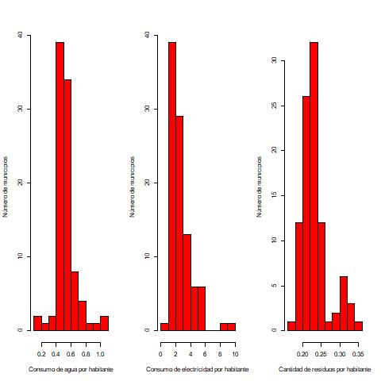
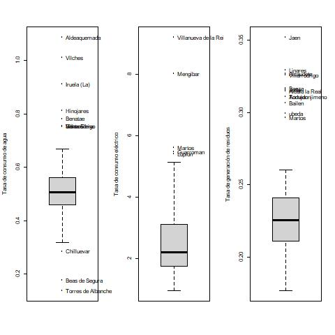

---
title: "Pr&aacute;cticas de Estad&iacute;stica. Pr&aacute;ctica 1"
author:
- name: Dr. Antonio Jos&eacute; S&aacute;ez Castillo, Departamento de Estad&iacute;stica e Investigaci&oacute;n Operativa, Escuela Polit&eacute;cnica Superior de Linares, Universidad de Ja&eacute;n
date: Versión `r format(Sys.Date(), "%d-%B-%Y")`
output:
  html_document:
    toc: true
    toc_float:
      collapsed: false
      smooth_scroll: false
    theme: united
    highlight: tango
subtitle: Estad&iacute;stica Descriptiva
---

```{r opciones, include=FALSE}
#knitr::opts_chunk$set(echo = FALSE, include=FALSE)
#knitr::opts_chunk$set(echo = TRUE, include=TRUE)
library(knitr)
```

# Objetivos

El objetivo general de la práctica es familiarizaros con el manejo de las funciones que permiten realizar un análisis estadístico descriptivo básico.

Más concretamente, podemos destacar los siguientes objetivos específicos:

- Aprender a importar datos y el manejo de variables.
- Obtener distribuciones de frecuencias en forma de tablas o representaciones gráficas.
- Obtener medidas de posición, dispersión y forma.
- Identificar valores atípicos.

# Funciones básicas

Función       | Acción                                      | Sintaxis básica
------------- | ------------------------------------------- | ---------------------------
table()       | Distribución de frecuencias absolutas       | table(variable)
barplot()     | Diagrama de barras                          | barplot(tabla)
hist()        | Histograma                                  | hist(variable)
boxplot()     | Diagrama de caja                            | boxplot(variable)
mean()        | Media                                       | mean(variable)
sd()          | Desviación típica                           | sd(variable)
quantile()    | Cuantiles                                   | quantile(variable, probs = p)

Ahora vamos a tratar de ilustrar cómo trabajan estas funciones con el desarrollo de un mini-proyecto. Es importante que te lo tomes *de menos a más*, es decir, que al principio te centres en aprender el funcionamiento básico, y posteriormente vayas profundizando poco a poco en los detalles de su uso.

# Análisis de indicadores de consumo doméstico y de generación de residuos en los municipios de la provincia de Jaén

## Resumen

El presente documento analiza la tasa de consumo eléctrico, el consumo de agua y la cantidad de residuos sólidos urbanos generados por habitante en la provincia de Jaén en 2008. Se trata de un análisis estadístico de tipo descriptivo que muestra una importante variabilidad en el consumo eléctrico, probablemente como consecuencia de la inclusión del sector industrial en la variable observada. Igualmente, destaca el hallazgo de un patrón atípico, bimodal, en la tasa de residuos generados por habitante que podría ser objeto de posteriores análisis. 

## Introducción

La provincia de Jaén comprende un total de 96 municipios de una tipología muy diversa. La capital es la menos pobladas de Andalucía y una de las más menos pobladas de España; aún así, es la ciudad más importante, en cuanto a población de la provincia, muy por encima del resto de municipios, la mayoría de los cuales pertenecen a un ámbito rural muy vinculado a la explotación del olivar.

El objetivo general de este trabajo es el de analizar tres indicadores de consumo en el hogar para tratar de describir el patrón de comportamiento de los municipios y, si existen, anomalías entre ellos. Como objetivos específicos, destacamos:

1. Realizar un análisis descriptivo básico de los tres indicadores.
2. Identificar la presencia de valores atípicos, tratando de explicar el sentido de la anomalía.

## Métodos

Los datos han sido descargados desde la herramienta **Sistema de información multiterritoria** del Instituto de Estadística y Cartografía de Andalucía (IECA). Las variables originalmente descargadas se refieren a todos los municipios de la provincia de Jaén, y recogen:

1. Código INE del municipio
2. Nombre del municipio
3. Consumo total de energía eléctrica del municipio, en Megavatios/Hora.
4. Consumo de agua en invierno del munipipio, en metros cúbicos al día.
5. Consumo de agua en verano del municipio, en metros cúbicos al día.
6. Destino de los residuos sólidos urbanos del municipio, con tres valores posibles: planta de compostaje, vertedero controlado y vertedero incontrolado.
7. Cantidad total de residuos sólidos urbanos generados en el municipio, en toneladas métricas.
8. Número de habitantes según el padrón municipal a 31 de diciembre de 2008.

```{r, importando, echo=FALSE}
# El fichero 'JaenIndicadores.xlsx' contiene la hoja de datos con indicadores. La importamos, llamando a la hoja 'jaen':
library(readxl)
jaen <- read_excel("JaenIndicadores.xlsx")
```

A partir de esas variables hemos obtenido tasas por habitantes de los indicadores deseados. Concretamente:

$$
\text{Tasa de consumo de agua} = \frac{\text{Consumo en invierno} + \text{Consumo en verano}}{\text{Habitantes}}
$$
$$
\text{Tasa de consumo eléctrico} = \frac{\text{Consumo total}}{\text{Habitantes}}
$$

$$
\text{Tasa de residuos generados} = \frac{\text{Total de residuos generados}}{\text{Habitantes}}
$$
```{r, preprocesamiento, echo=FALSE}
jaen$tasa.agua <- (jaen$Consumo.de.agua..Invierno + jaen$Consumo.de.agua..Verano) / jaen$Poblacion
jaen$tasa.elec <- jaen$Consumo.de.energia.electrica / jaen$Poblacion
jaen$resid.hab <- jaen$Residuos.solidos.urbanos..Cantidad / jaen$Poblacion
# Las tres tasas son variables cuantitativas continuas; el destino de los residuos es cualitativa
```

Las variables que se analizan en el trabajo son precisamente estas tres tasas por habitante y el destino de los residuos sólidos urbanos.

En el caso del destino de los residuos, dado que se trata de una variable cualitativa, se ha obtenido su distribución de frecuencias, que se plasma en un diagrama de barras. Para las tres tasas, al tratarse de variables de tipo cuantitativo continuo, se proporciona:

1. Una representación de su distribución de frecuencias a través de un histograma.
2. Medidas de posición (media y cuartiles), dispersión (coeficiente de variación) y forma (coeficiente de asimetría de Fisher).
3. Una representación en un diagrama de caja para identificar los valores atípicos.

## Resultados

La distribución de frecuencias de la variable sobre el destino de los residuos sólidos urbanos aparece en la Tabla 1, donde se han incluido tanto las frecuencias absolutas como las relativas, expresadas éstas en porcentajes. Dicha distribución de frecuencias aparece igualmente representada en el diagrama de barras de la Figura 1.

```{r, tabla1, echo=FALSE}
tabla.destino <- table(jaen$Residuos.solidos.urbanos..Destino)
# De cara al examen sólo sería necesario facilitar como salida esta versión de tabla.destino, pero vamos a 'tunearla' un poco
# 1. Convertimos la tabla en una hoja de datos:
hoja.destino <- data.frame(tabla.destino)
# 2. Añadimos los porcentajes:
hoja.destino$Porcentaje <- 100 * hoja.destino[, 2] / sum(hoja.destino[, 2])
# 3. Ponemos nombres a las columnas de esa tabla
names(hoja.destino) <- c("Destino", "Frecuencia", "Porcentaje")
# 4. Sacamos 'en pantalla' esa tabla con un aspecto mejorado
library(knitr)
kable(hoja.destino, digits = 2, caption = "Tabla 1. Distribución de frecuencias del destino de los residuos sólidos urbanos")
```

```{r, figura1, echo=FALSE}
# barplot(tabla.destino)
# De nuevo, de cara al examen, sería suficiente con esta versión inicial, pero nosotros podemos hacerlo mejor:

# 1. ¿Cuántos colores necesito para las barras? Me lo dice la dimensión de la tabla
n.col <- dim(tabla.destino)
# 2. Creemos una paleta de colores
colores <- rainbow(n.col)
# 3. Ahora el diagrama con colores y ejes bien etiquetados
barras.destino <- barplot(tabla.destino, col = colores, ylab = "Número de municipios", xlab = "Figura 1. Destino de los residuos sólidos urbanos")
# 4. Añadamos incluso las frecuencias al diagrama
text(x = barras.destino, y = tabla.destino, labels = tabla.destino, pos = 3, xpd = TRUE)
```

Por su parte, en lo que se refiere a las tasas de consumo de agua, eléctrico y de generación de residuos por habitante, su distribución de frecuencias aparece representada en los histogramas de la Figura 2.

```{r, figura2, echo=FALSE, results='hide'}
# De cara al examen, sería suficiente con
# hist(jaen$resid.hab)
# hist(jaen$tasa.agua)
# hist(jaen$tasa.elec)
# Pero aquí vamos a darle 'vidilla' a estos gráficos. Es facil:

# Vamos a guardar la figura en un fichero:
jpeg("figura2.jpg")
# 1. Primero dividimos la pantalla de una matriz de 1 fila y 3 columnas, una para cada histograma:
par(mfrow = c(1, 3))
# 2. Ahora cada uno de los histogramas:
hist(jaen$tasa.agua, xlab = "Consumo de agua por habitante", ylab = "Número de municipios",  col = 'red', main = "")
hist(jaen$tasa.elec, xlab = "Consumo de electricidad por habitante", ylab = "Número de municipios",  col = 'red', main = "")
hist(jaen$resid.hab, xlab = "Cantidad de residuos por habitante", ylab = "Número de municipios",  col = 'red', main = "")
# 'Cerramos' el fichero 'figura1.jpg'
dev.off()
```



En lo que respecta a las medidas mencionadas de posición, dispersión y forma, aparecen todas recogidas en la Tabla 2.

```{r, tabla2, echo=FALSE}
# Vamos a juntar todas las medidas en una tabla. Empezamos:
# Las medias:
medias <- c(mean(jaen$tasa.agua, na.rm = TRUE),
            mean(jaen$tasa.elec, na.rm = TRUE),
            mean(jaen$resid.hab, na.rm = TRUE))
# ¿Para qué sirve lo de na.rm = TRUE

# Los cuartiles:
p25s <- c(quantile(jaen$tasa.agua, probs = 0.25, na.rm = TRUE),
          quantile(jaen$tasa.elec, probs = 0.25, na.rm = TRUE),
          quantile(jaen$resid.hab, probs = 0.25, na.rm = TRUE))
p50s <- c(quantile(jaen$tasa.agua, probs = 0.5, na.rm = TRUE),
          quantile(jaen$tasa.elec, probs = 0.5, na.rm = TRUE),
          quantile(jaen$resid.hab, probs = 0.5, na.rm = TRUE))
p75s <- c(quantile(jaen$tasa.agua, probs = 0.75, na.rm = TRUE),
          quantile(jaen$tasa.elec, probs = 0.75, na.rm = TRUE),
          quantile(jaen$resid.hab, probs = 0.75, na.rm = TRUE))

# Coeficientes de variación:
cvs <- c(sd(jaen$tasa.agua, na.rm = TRUE) / mean(jaen$tasa.agua, na.rm = TRUE),
         sd(jaen$tasa.elec, na.rm = TRUE) / mean(jaen$tasa.elec, na.rm = TRUE),
         sd(jaen$resid.hab, na.rm = TRUE) / mean(jaen$resid.hab, na.rm = TRUE))

# Coeficiente de asimetría:
# Primero tenemos que definir una función que calcule el coeficiente, porque R base no la tiene:
coef.asim <- function(datos){
  # datos debe ser un vector
  # Eliminamos datos faltantes, si existen
  x <- datos[is.na(datos) == FALSE]
  N <- length(x)
  # Definimos el coeficiente
  sn <- sqrt(sum((x - mean(x))^2) / N)
  (sum((x - mean(x))^3) / N) / sd(x)^3
}

# Ahora sí:
asims <- c(coef.asim(jaen$tasa.agua), coef.asim(jaen$tasa.elec), coef.asim(jaen$resid.hab))

# Ya que lo tenemos todo, lo ponemos junto en una hoja de datos:
medidas <- data.frame(
  row.names = c("Tasa de consumo de agua", "Tasa de consumo eléctrico", "Tasa de generación de residuos"),
  "Media" = medias,
  "P25" = p25s,
  "Mediana" = p50s,
  "P75" = p75s,
  "CVs" = cvs,
  "Coef.asimetría" = asims)

# La sacamos con buen aspecto
kable(medidas, digits = 2, caption = "Tabla 2. Medidas estadísticas descriptivas")
```

Finalmente, como se menciona en la metodología, utilizamos los diagramas de caja de la Figura 3 para identificar valores atípicos.

```{r, cajas, echo=FALSE, results='hide'}
jpeg("cajas.jpg")

par(mfrow = c(1, 3), xpd = TRUE)

caja.agua <- boxplot(jaen$tasa.agua, ylab = "Tasa de consumo de agua")
# Ahora vamos a 'etiquetar' cada valor atípico con el nombre del municipio al que corresponde:
# El vector caja.agua$stats tiene 5 elementos: el bigote inferior, el P25, la mediana, el P75 y el bigote superior. Por tanto, el filtro que define los valores atípicos es
filtro.agua <- jaen$tasa.agua < caja.agua$stats[1] | jaen$tasa.agua > caja.agua$stats[5]
# El número de atípicos es
n.atip.agua <- sum(filtro.agua, na.rm = TRUE)
# Vamos a introducir el nombre de los municipios atípicos en el diagrama
# Coordenadas 'x' de los atípicos
x.atip.agua <- rep(1, n.atip.agua)# La caja de la tasa de agua está en x=1
# Coordenadas 'y' de los atípicos
y.atip.agua <- jaen$tasa.agua[filtro.agua]
# Nombres de los atípicos
nom.atip.agua <- jaen$Municipio[filtro.agua]
# Finalmente, escribamos donde corresponde
text(x.atip.agua, y.atip.agua, nom.atip.agua, pos = 4)

caja.elec <- boxplot(jaen$tasa.elec, ylab = "Tasa de consumo eléctrico")
filtro.elec <- jaen$tasa.elec < caja.elec$stats[1] | jaen$tasa.elec > caja.elec$stats[5]
n.atip.elec <- sum(filtro.elec, na.rm = TRUE)
x.atip.elec <- rep(1, n.atip.elec)# La caja de la tasa eléctrica está en x=1
y.atip.elec <- jaen$tasa.elec[filtro.elec]
nom.atip.elec <- jaen$Municipio[filtro.elec]
text(x.atip.elec, y.atip.elec, nom.atip.elec, pos = 4)

caja.res <- boxplot(jaen$resid.hab, ylab = "Tasa de generación de residuos")
filtro.res <- jaen$resid.hab < caja.res$stats[1] | jaen$resid.hab > caja.res$stats[5]
n.atip.res <- sum(filtro.res, na.rm = TRUE)
x.atip.res <- rep(1, n.atip.res)# La caja de la tasa de residuos está en x=1
y.atip.res <- jaen$resid.hab[filtro.res]
nom.atip.res <- jaen$Municipio[filtro.res]
text(x.atip.res, y.atip.res, nom.atip.res, pos = 4)

dev.off()
```



## Análisis

En lo que se refiere al destino de los residuos sólidos urbanos, llama la atención que sólo la cuarta parte de los municipios utilizan plantas de compostaje para su tratamiento. Incluso sorprende la presencia de 11 municipios que utilizan vertederos no controlados para su almacenaje: `r jaen$Municipio[jaen$Residuos.solidos.urbanos..Destino == "Vertedero incontrolado"]`. 

El patrón de comportamiento de los municipios de la provincia en lo relativo a las dos tasas de consumo y a la generación de residuos es muy heterogéneo, tal y como se refleja en la Figura 2 y denota la Tabla 1:

1. La mayoría de los municipios de la provincia (más del 50% a tenor del valor de los percentiles 25 y 75) se sitúan en un consumo de agua por habitante de entre 0.4 y 0.6 metros cúbicos por habitante y día, con una variabilidad entre municipios moderada (CV = 0.26). La forma de la distribución de frecuencias, claramente asimétrica a la derecha, indica la presencia de municipios donde el consumo por habitante es mucho mayor. De hecho, el diagrama de caja de la Figura 3 correspondiente al consumo de agua indica que muestra cómo municipios como Aldeaquemada, Vilches o La Iruela tienen un consumo extremadamente atípico por su alto valor, mientras que otros, como Torres de Albanchez o Beas de Segura destacan por todo lo contrario. En ese sentido, siendo todos ellos municipios pequeños y de situados en comarcas de sierra, no es fácil encontrar un motivo que explique las diferencias.
2. Los datos sobre el consumo eléctrico por habitante destacan por su fuerte asimetría a la derecha (Coeficiente de asimetría = 2.05). Frente a una mayoría de municipios con un consumo promedio en torno a 2Kw/h por habitante, existe un grupo reducido de municipios de un consumo mucho mayor, en el que destacan Villanueva de la Reina, Mengíbar, Martos, Guarromás y Lupión, municipios atípicos. Esa fuerte asimetría es la causante de la elevada variabilidad (CV = 3%).
3. En el caso de la cantidad promedio de residuos generados por habitante, el histograma muestra que los datos ocultan la presencia de dos subpoblaciones. Si observáramos los datos separados entre municipios de promedio por encima y por debajo de 0.275, ambos grupos presentarían una forma típica de distribución simétrica. Sin embargo, la unión de esos dos grupos, el primero en torno a un valor modal de 0.22, y el segundo en torno a 0.31, da como resultado una clara asimetría a la derecha (1.39), a pesar de que la variabilidad relativa es la menor de los tres indicadores. Cabe destacar que, como se muestra en la Figura 3, son los municipios de mayor tamaño de la provincia los que, en su mayoría, conforman esa subpoblación donde el promedio de generación de residuos es mayor.

## Conclusiones

La primera conclusión que queremos destacar es que algunos de los indicadores reflejan diferencias entre los municipios más poblados frente a los menos habitados: son municipios pequeños los que depositan los residuos en vertederos incontrolados y son municipios grandes los que resultan atípicos frente al resto por la cantidad promedio de residuos que generan.

No hemos logrado comprender la estructura que muestra la distribución de la variable sobre el consumo promedio de agua. La presencia de municipios atípicos tanto por su elevado como por su reducido consumo promedio no nos ha permitido detectar ningún patrón que explique el por qué de dicha variabilidad. Sería necesario un análisis más profundo y con un conocimiento más exhaustivo del tema para lograr arrojar luz sobre ello.

Sin embargo, en el caso del consumo promedio de energía eléctrica es la presencia de los datos atípicos la que nos permite comprender qué provoca esa distribución en la que la mayoría de municipios se concentra en torno a 2 Kw/h por habitante, pero otros cuantos se sitúa en valores muy superiores. Villanueva de la Reina es un municipio pequeño en cuyo término municipal se situaban (y se sitúan aún hoy) enj 2008, en plena burbuja inmobiliaria, las dos plantas de la empresa de fabricación de materiales de construcción MALPESA; en Méngíbar, de tamaño pequeño - mediano, se halla la importante fábrica de papel Smurfit Kappa; en Guarromán destaca un enorme polígono industrial situado muy cerca de Linares; finalmente, Martos cuenta con la importante factoría de la multinacional Valeo. Lo que claramente dejan traslucir esto es que la variable no sólo está contabilizando el consumo promedio de los hogares, sino que también suma el consumo industrial, lo que se refleja sobre todo en los municipios más pequeños.